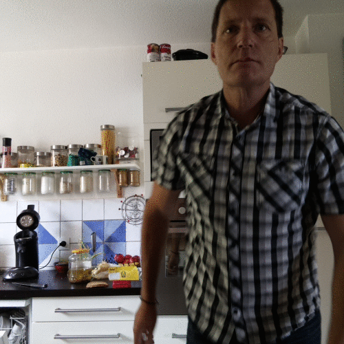

# TouchSelfie
Open Source Photobooth forked and improved from [wyolum/TouchSelfie](https://github.com/wyolum/TouchSelfie)

For hardware construction, see [Make Magazine article](https://makezine.com/projects/raspberry-pi-photo-booth/)

## Installing (extracted and adapted from [Make Magazine](https://makezine.com/projects/raspberry-pi-photo-booth/))

### Get the necessary packages

```
# update system 
sudo apt-get update

# Install ImageTk, Image from PIL
sudo apt-get install python-imaging
sudo apt-get install python-imaging-tk

# Install google data api and upgrade it
sudo apt-get install python-gdata
sudo pip install --upgrade google-api-python-client

# Install ImageMagick for the 'Animation' mode
sudo apt-get install imagemagick
```

If google chrome is not on your system, the following might be necessary:

```
sudo apt-get install luakit
sudo update-alternatives --config x-www-browser
```

### Configure the program

1. run `setup.sh` script, this will:
  - guide you through the feature selection (email feature, upload feature)
  - Google credentials retrieval and installation
  - Google Photos album selection
  - and will create a `photobooth.sh` launcher

2. Optionally you can change configuration options in the file `scripts/constants.py` such as:
  - captured image sizes
  - the logo file to put on your pictures
  - email subject and body
  - wether or not to archive snapshots locally
  - ...


## Changes from [wyolum/TouchSelfie](https://github.com/wyolum/TouchSelfie)

### Easier setup
- a new `setup.sh` script will help you configure the features you need (send_email, auto-upload) and will guide you for the Google credentials setup and photo album selection.

### Hardware buttons support
- Added GPIO hardware interface for three buttons (with connections in hardware/ directory). Each button triggers a different effect. Software buttons are added if GPIO is not available

### New effects
- Added "Animation" effect that produces animated gifs (needs imagemagick)



### Higher resolution pictures
- supports new v2.1 pi camera
- Supports arbitrary resolution for snapshots (configure it in constants.py)

### User interface improvements

- Modern "black" userinterface with icon buttons


- Preview now uses builtin annotate_text and opaque preview window

- New skinnable Touchscreen keyboard "mykb.py"


- Removed configuration button to avoid pranks
  - use `setup.sh` to setup credentials and setup Google Photo Album
  - tune configuration in `constants.py`

- snapshot view now supports animated gifs

- command line arguments to enable/disable some features:
  - enable/disable fullscreen startup
  - enable/disable email sending
  - enable/disable auto-upload
  - enable/disable hardware buttons support (on-screen buttons displayed instead)
  - *Use `python user_interface.py --help` for a description of command line options*
